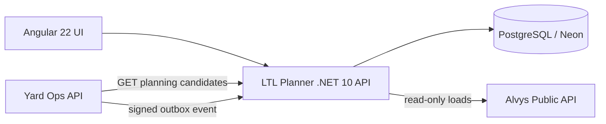

# Architecture



## Boundary

LTL Planner owns internal shipment planning, capacity validation, and explainable assignment results. It exposes a narrow, versioned integration contract to Yard Ops rather than sharing tables or domain entities.

## Persistence and state rules

Orders, trucks, plans, Yard events, and the Yard trailer read model are persisted through EF Core 10 to PostgreSQL. Mutable orders, trucks, and plans use PostgreSQL `xmin` optimistic concurrency. Startup migrations are attempted before seeding; `/health` is liveness and `/health/ready` reports database reachability.

Order state: `Open -> Planned -> Dispatched`, with `Open -> Cancelled`. Only Open orders may be edited. Plan state: `Draft -> Committed|Discarded`. Commit is transactional and succeeds only when every order in the draft is still Open. Yard event IDs are unique and accepted idempotently; accepted events update the Yard trailer read model in the same transaction.

## Planning

`PlannerService` orders unassigned shipments by priority, pallets, and weight, then places each one on the compatible truck with the best score. Compatibility (equipment, pallet capacity, weight capacity) is a hard filter applied before scoring; scoring only ranks trucks that can legally take the shipment. Each planned truck carries a plain-language explanation of why its orders were grouped.

## Yard integration contract

Exposed under `/api/integrations/v1/`:

- `GET yard/candidates?trailerNumber=&equipment=&maxPallets=`: unassigned orders that fit a trailer's declared equipment and pallet capacity. Final truck/route validation stays in LTL.
- `POST yard/events`: Yard state-change events. The raw body must carry an `X-Portfolio-Signature` HMAC-SHA256 header computed with the shared `YARD_LTL_SIGNING_KEY`. Events are stored idempotently by `eventId`; unknown `schemaVersion` values are rejected at the edge.
- `GET yard/events`: the received event inbox, shown on the operations screen.

## Failure behavior

- External Alvys calls have bounded timeouts/resilience and surface degraded state instead of fabricating data.
- Unsigned or incorrectly signed events are rejected with `401`.
- Duplicate events are acknowledged but not re-applied.

## Cloudflare topology

```text
        Cloudflare edge
              |
   <APP_HOST> or ltl-planner.<account>.workers.dev
              |
     Worker + Angular assets
              |  /api/*, /health
              v
     LTL .NET 10 Container
```

Operational state is durable in PostgreSQL/Neon. The Cloudflare Container is stateless and may sleep without losing orders, trucks, plans, Yard events, or the Yard trailer read model. A protected scheduled reset restores the fictional seed dataset for the public demo.
