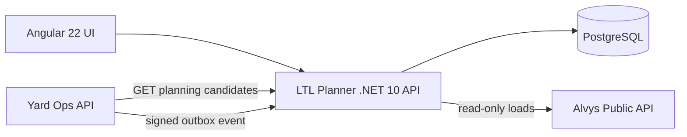

# Architecture



## Boundary

LTL Planner owns internal shipment planning, capacity validation, and explainable assignment results. It exposes a narrow, versioned integration contract to Yard Ops rather than sharing tables or domain entities.

## Data model

Orders, trucks, plans, Yard events and a per-trailer view, in one EF Core context (`api/Data`). Migrations target PostgreSQL and are applied by the deploy pipeline (`dotnet Portfolio.*.Api.dll migrate`, run as the schema owner over a direct connection) before the new container starts; the running app connects through the pooler as a role that can only read and write rows, and reports not-ready if the schema is behind its build. Local runs and Compose still migrate on startup (`Database:MigrateOnStartup`); without `DATABASE_URL` the API creates a throwaway SQLite database from the same model so the demo still runs.

A plan stores the planner's full result (trucks, orders, explanations, unplaced orders and reasons) as a JSON snapshot. It is always read back whole, and the snapshot is what a commit is checked against.

## Plan lifecycle

1. **Build** plans open orders onto active trucks and saves a Draft. Nothing else changes.
2. **Commit** runs in one transaction: every order must still be Open with the same pallets, weight and equipment, and every truck still active with the same capacity. Then the orders become Planned on their trucks. Otherwise it returns 409, lists what changed, and changes nothing.
3. **Discard** closes a draft. Planned orders can then be **dispatched**; open orders can be edited or **cancelled**.

## Planning

`PlannerService` orders unassigned shipments by priority, pallets, and weight, then places each one on the compatible truck with the best score. Compatibility (equipment, pallet capacity, weight capacity) is a hard filter applied before scoring; scoring only ranks trucks that can legally take the shipment. Each planned truck carries a plain-language explanation of why its orders were grouped, and every order that could not be placed gets a reason: no active truck with that equipment, too large for any such truck, or every such truck already full with higher-priority orders.

## Yard integration contract

Exposed under `/api/integrations/v1/`:

- `GET yard/candidates?trailerNumber=&equipment=&maxPallets=`: open orders that fit a trailer's declared equipment and pallet capacity. Final truck/route validation stays in LTL.
- `POST yard/events`: Yard state-change events. The request must carry `X-Portfolio-Timestamp` (unix seconds) and an `X-Portfolio-Signature` HMAC-SHA256 of `{timestamp}.{raw body}` computed with the shared `YARD_LTL_SIGNING_KEY`; timestamps more than five minutes from LTL's clock are rejected, so a captured request cannot be replayed. Events are stored once, keyed by `eventId` in the database, and each accepted event updates the trailer view in the same transaction (an event older than the trailer's latest one never overwrites its status); unknown `schemaVersion` values are rejected at the edge.
- `GET yard/events`: the received event inbox, shown on the operations screen.

## Failure behavior

- External Alvys calls have bounded timeouts/resilience and surface degraded state instead of fabricating data.
- Unsigned or incorrectly signed events are rejected with `401`.
- Duplicate events are acknowledged but not re-applied.

## Cloudflare topology

```text
        Cloudflare edge
              |
   <APP_HOST> or ltl-planner.<account>.workers.dev
              |
     Worker + Angular assets
              |  /api/*, /health
              v
     LTL .NET 10 Container
```

All state lives in PostgreSQL, so nothing is lost when the container sleeps after 10 minutes without traffic. During weekday business hours a cron pings `/health/ready` every five minutes to keep the container and the Neon compute warm.
